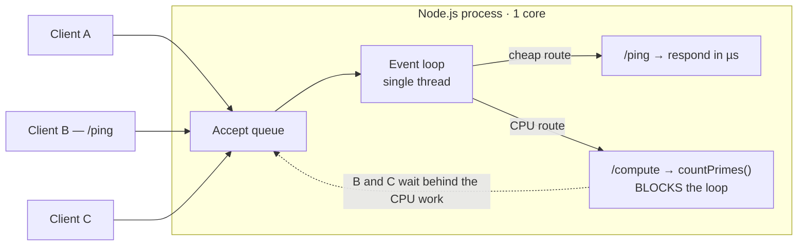
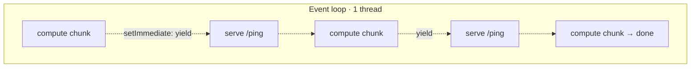
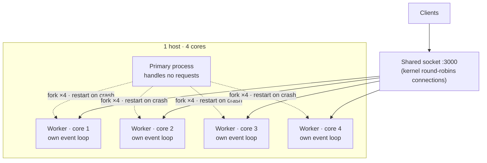
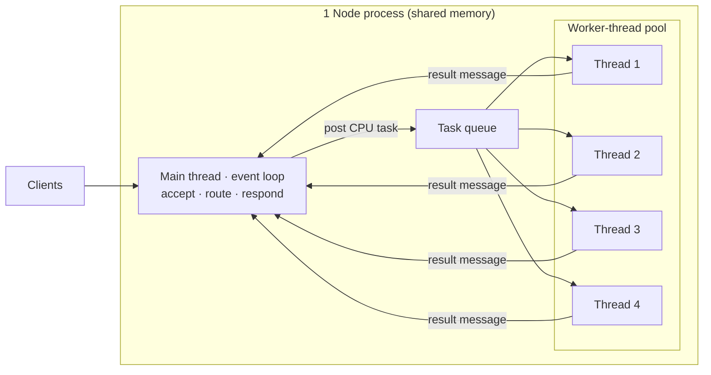
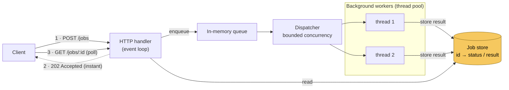
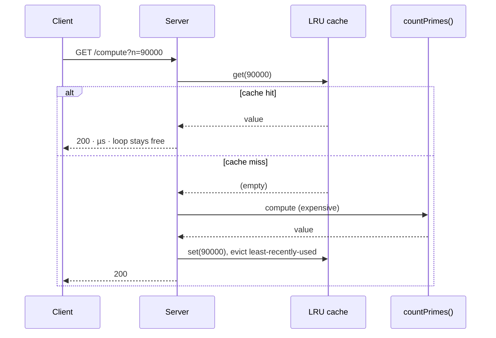
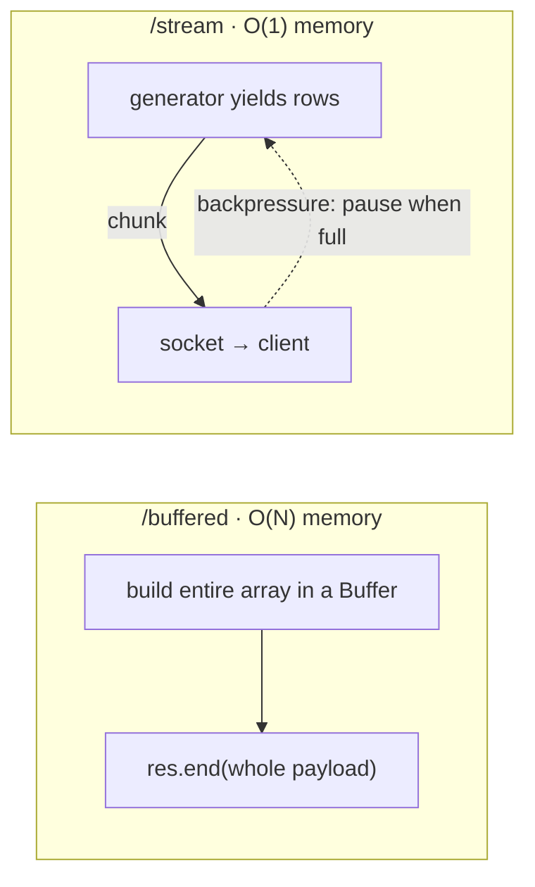
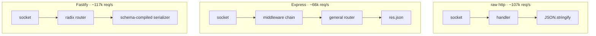
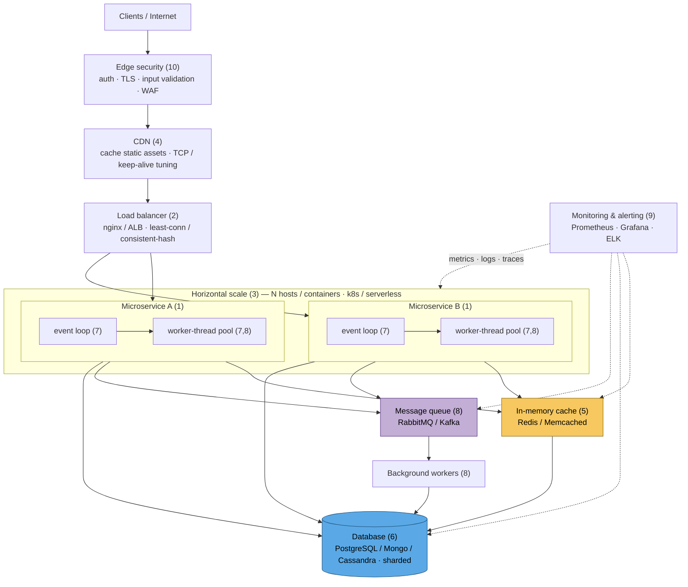
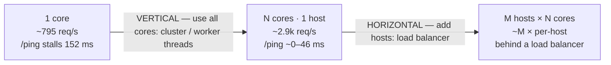

# Architecture & scaling diagrams

System-design view of the eight approaches in this repo, and how each one scales.
All diagrams are [Mermaid](https://mermaid.js.org/) and render directly on GitHub.

It also lays out a 10-point blueprint for a high-load system: microservices,
load balancing, horizontal scaling, optimized networking/CDN, in-memory caching,
database optimization, performance optimization, asynchronous processing,
monitoring, and security. Section 8 draws that full blueprint and maps each point
to the runnable examples here.

**Notation:** rectangles = processes/threads · cylinders = datastores ·
solid arrows = request/data flow · dashed arrows = lifecycle or backpressure.
`req/s` and latency numbers are the measured results from the
[README](../README.md#measured-results) (Apple M4 Pro, 14 cores, Node 24).

---

## 0. The model & the problem — one event loop, one thread

Node runs your JavaScript on a **single** event-loop thread. I/O is offloaded to
libuv's pool, but **CPU work runs on that one thread** — and while it runs,
nothing else does. This is example [`01-blocking`](../src/01-blocking).

> Result: throughput capped at ~1 core (~795 req/s), and a trivial `/ping`
> stalls ~152 ms because it is stuck behind the CPU work.

---

## 1. Stay fair on one core — cooperative chunking

Same one thread, but the CPU work is sliced and `setImmediate` hands control back
between slices. It is **not faster**, but the loop is never monopolized, so other
requests stay responsive. Example [`02-nonblocking`](../src/02-nonblocking).

> Trade-off: fairness, not capacity. Great for keeping health checks/other
> requests alive; it does not add CPU throughput.

---

## 2. Vertical scale, processes — the cluster module

The primary process `fork()`s one worker **process** per core; all workers share
the listening socket and the kernel load-balances connections across them. A
blocked worker no longer blocks the others. Example [`03-cluster`](../src/03-cluster).

> Result: ~2,879 req/s (~3.6× vs one core) and `/ping` under load drops to ~46 ms.
> Separate memory per worker; self-healing when a worker dies.

---

## 3. Vertical scale, threads — a worker pool

One process, but CPU tasks are posted to a pool of worker **threads**. The main
thread only accepts, routes, and responds, so its event loop stays free even when
every thread is busy. Example [`04-worker-threads`](../src/04-worker-threads).

> Result: ~2,742 req/s and `/ping` under load stays ~0 ms — the request loop is
> never blocked. **Cluster vs threads:** cluster = many processes (isolation,
> scale the whole app); worker pool = many threads in one process (shared memory,
> offload CPU from the request loop).

---

## 4. Async processing — enqueue now, process later

Don't do heavy work inside the request at all. The handler enqueues a job and
returns `202` immediately; a bounded set of background workers drains the queue
(here, the worker-thread pool from section 3). Clients poll for the result. This
decouples the throughput of *accepting* work from the throughput of *doing* it.
Example [`09-queue`](../src/09-queue) — the local, dependency-free analog of a
message queue (RabbitMQ / Kafka) with consumers.

> The catch: accept-rate ≠ process-rate. Enqueue is O(1), so the queue can accept
> far more than the workers can finish — `queue.depth` grows. In production you
> **bound the queue** (reject/apply backpressure when full) and **scale
> consumers**. The win is that a traffic spike no longer stalls the event loop;
> it just lengthens the queue.

---

## 5. Don't do the work twice — caching

A bounded LRU turns repeated/hot keys into µs responses. Misses still cost the
full compute (pair with cluster/threads); hits skip it entirely.
Example [`05-caching`](../src/05-caching).

---

## 6. Bound memory under load — streaming

Buffering builds the whole response in RAM (O(N) per in-flight request → GC
pressure / OOM at scale). Streaming emits chunks with backpressure, so per-request
memory is ~flat. Example [`06-streaming`](../src/06-streaming).

---

## 7. Framework overhead — raw http vs Express vs Fastify

Frameworks are **orthogonal** to the event-loop story (`/compute` blocks in all
three), but they differ on the per-request hot path. Measured on cheap `/ping`,
single process. Examples [`07-express`](../src/07-express) / [`08-fastify`](../src/08-fastify).

---

## 8. Putting it together — the full high-load blueprint

Combining all 10 points gives a full system-design topology. Here it is with each
point numbered, so you can see where the runnable examples in this repo fit and
where the rest is infrastructure.

### How the 10 points map to this repo

| # | High-load concern | In this repo | Runnable? |
|---|---------------|--------------|-----------|
| 1 | Application architecture (microservices) | each server is a small single-purpose service | ✅ all `src/*` |
| 2 | Load balancing | the kernel load-balancing the cluster's shared socket is the local analog | ◐ `03-cluster` |
| 3 | Horizontal scaling | shown in the topology; cluster is the single-host (vertical) analog | ○ diagram only |
| 4 | Optimized networking / CDN | infrastructure (nginx, CDN, TCP tuning) | ○ infra |
| 5 | In-memory caching | bounded LRU memoization | ✅ `05-caching` |
| 6 | Database optimization | infrastructure (indexes, sharding) | ○ infra |
| 7 | Performance optimization (don't block, stream) | blocking vs chunked vs cluster vs threads; streaming | ✅ `01,02,03,04,06,07,08` |
| 8 | Asynchronous processing (worker threads / queues) | worker-thread pool + an in-process job queue with background workers | ✅ `04-worker-threads`, `09-queue` |
| 9 | Monitoring & alerting | event-loop delay + memory via `/stats` (a mini version) | ✅ `common/stats.js` |
| 10 | Security & compliance | infrastructure (authn/z, TLS, validation) | ○ infra |

Legend: ✅ runnable & load-testable here · ◐ partial local analog · ○ diagram/infrastructure only.

---

## 9. The two axes of scaling

| Axis | Mechanism | In this repo | Bounded by |
|------|-----------|--------------|-----------|
| Stay responsive | chunk work / async I/O | `02-nonblocking` | still 1 core |
| Vertical (cores) | cluster **or** worker threads | `03`, `04` | cores per host |
| Skip work | cache / memoize | `05` | hit rate, memory |
| Bound memory | stream with backpressure | `06` | — |
| Lower per-req cost | framework choice | `07`, `08` | app logic |
| Horizontal (hosts) | load balancer + stateless nodes | topology above | infra / shared state |
